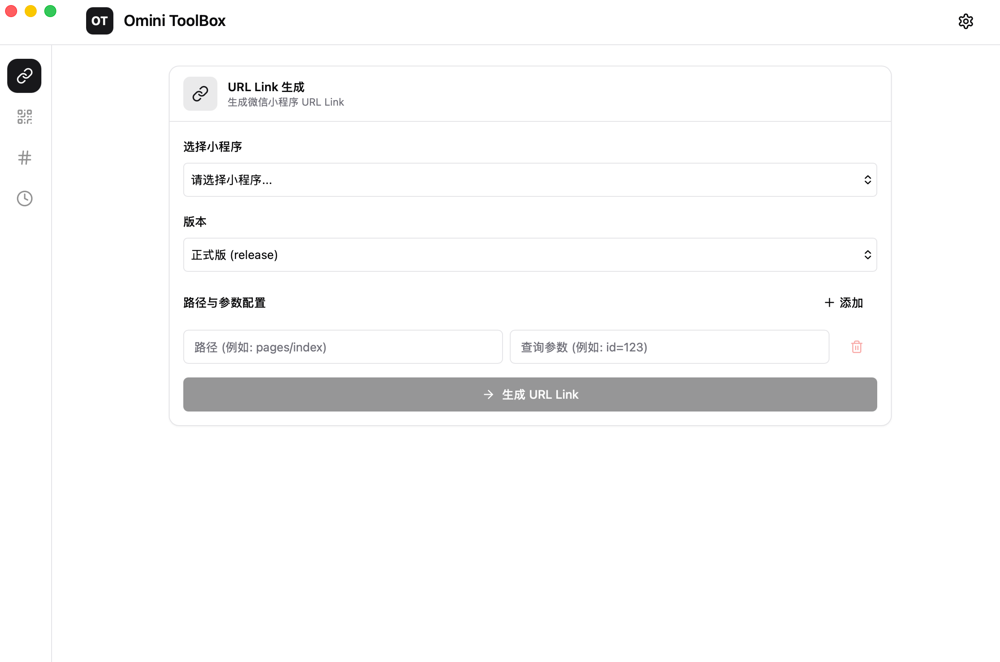

# Omini ToolBox

[](https://opensource.org/licenses/MIT)


A cross-platform desktop toolbox application built with Tauri + React.



## Features

### Core Features

- **WeChat Mini Program URL Link Generation** - Batch generate Mini Program URL Links via WeChat API
- **Mini Program Configuration Management** - Manage multiple WeChat Mini Program AppID and AppSecret
- **Theme Support** - Light/Dark/System-following theme modes
- **Settings Persistence** - Local storage for configuration and Token cache

### Tech Stack

- **Frontend**: React 19 + TypeScript + Vite + Tailwind CSS
- **Backend**: Tauri 2 (Rust)
- **Storage**: Local JSON files

## Getting Started

### Prerequisites

- Node.js >= 18
- Rust >= 1.70
- Tauri CLI

### Install Dependencies

```bash
npm install
```

### Development Mode

```bash
npm run dev
```

### Build Application

```bash
# Build for all platforms
npm run build

# Build for specific platform
npm run build:linux
npm run build:macos
npm run build:windows
```

## Project Structure

```
omini-toolbox/
├── src/                    # Frontend React code
│   ├── main.tsx           # Application entry
│   ├── App.tsx            # Main application component
│   ├── pages/             # Page components
│   └── components/        # Shared components
├── src-tauri/             # Tauri backend (Rust)
│   ├── src/
│   └── tauri.conf.json
└── package.json
```

## Roadmap

- QR Code generation
- URL encode/decode
- Timestamp conversion

## License

This project is licensed under the MIT License.

## Contributing

Issues and Pull Requests are welcome!
